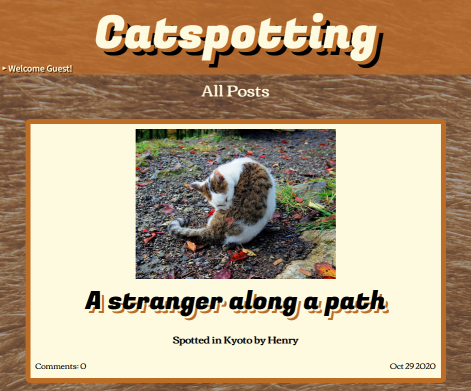
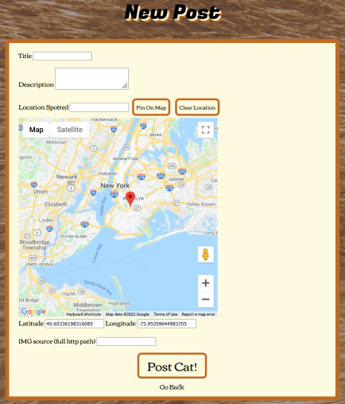
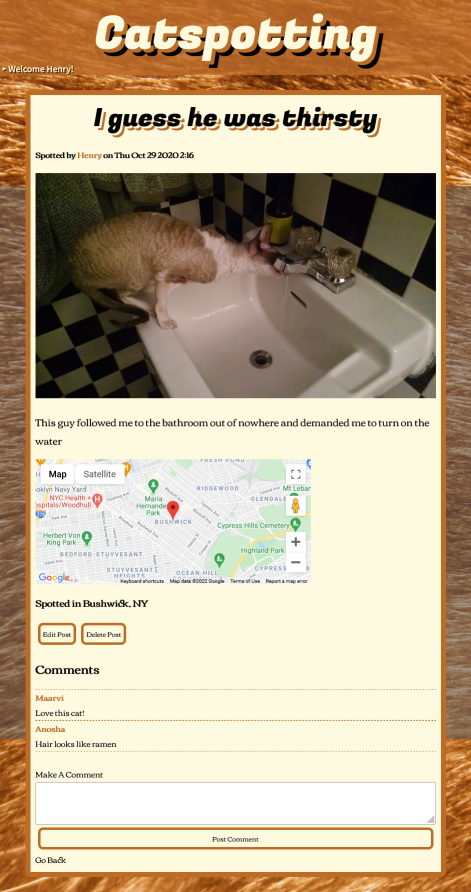
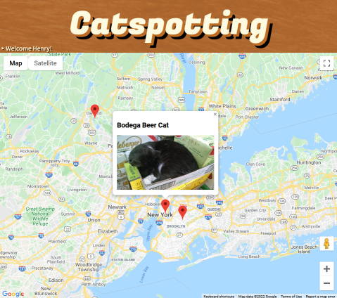
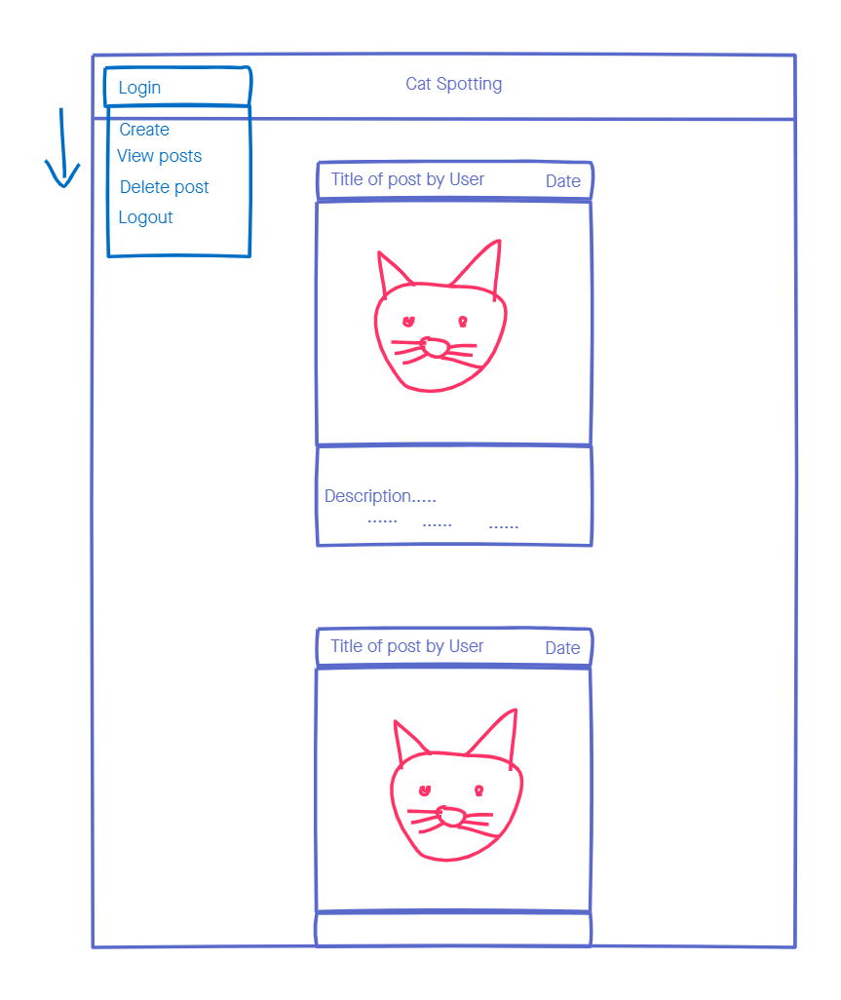

# "🐈Catspotting🐈"
### *A place to share pictures of cats that have randomly crossed your path*
### https://cat-spotting.herokuapp.com/catspotting/

## Screenshots
Main Index

    
More Screenshots

    
New Post

    
    
Post with Comments

    
    
World Map

    

## Project Overview
In this second GA SEI project, we were assigned to create a full CRUD web application for users, creating both the front-end for users to interact with, as well the back-end to store our data. What this webapp could be would be entirely up to us. As I was trying to come up with an idea or theme to apply what we learned this section, I was scrolling through my phone’s pictures I’ve taken during quarantine, which were mostly random animals that would cross my path on my daily, mandated walks.  After seeing most of them were cats, I decided why not make it a website where users can post their own random encounters spotting cats. Thus, my project was born: catspotting.

Starting off the project was pretty straightforward. Users should be able make posts that contained a source path to a picture of a cat, with an optional title, description, and location. So, I first set up my database using MongoDB to create a schema with those properties in mind, then made correlating paths where users could have full CRUD interactivity. I then added user sessions, so only users who are the authors of their own posts could have full CRUD and worked my code to explicitly define those roles. My MVP was practically reached at that point, so I wanted to reach for one of my stretch goals, and I figured adding Google Maps via API would work really well, since after all, this is a site sharing not just what cat you spot but where you did as well.

It was my first real experience working with an API, so I had to do a fair amount of reading documentation and experimentation, learning about marker placement, extracting co-ordinates from mouse click events, and geocoding. The more I worked with it, the more ideas for the application came to me, including having the user being able to see a full map of all cat spotting posts (provided the authors gave coordinates). This was likely the most difficult, not just because I had correctly code how to place the markers but figure out how transfer the data from server to client so javascript could correctly render them. 

After accomplishing that, I spent some time making the website presentable with CSS, as well formatting time output display, and tweaked INDEX and SHOW renders, and even added abilities to add comments to posts. Ultimately, I’m happy how this project came out in the short time I had to work on it.

## Wireframes

The wireframe was pretty straight forward and simple, much like the webpage itself. There's almost no deviations from it, including the drop-down menu. Though most other paths were made on the fly.

## User Stories
* When a user enters a site, they should be greeted with a feed of most recent cat posts.
* Each post will have:
    * An image of a cat (unless a user messes up referencing an image source)
    * What user posted the image
    * When that image was posted
    * Where that cat was spotted (if user provided a location)
* If a user wants to find out more about a certain image, clicking on post will show more information, such as:
    * A description provided by the user
    * A marker on an interactive google map frame where the cat was spotted
    * Comments from other users
* If a user wishes to contribute or make comments, they must create an account, and have to click on the drop-menu in the upper left corner and select Sign up
* They will create an account and then need to login with their credentials
* After logging in, the user will have more options, such as a place to see all their posts they've made, as well an option to create a post
* If a user wishes to create a post after logging in, they select new post, and are given a form to fill out.
* After filling out and hitting submit, anytime a user views the show path for that post, more options are presented on their post to edit or delete their post
* Logged in users will also be able to add a comment to any post as well.

## Technologies used
* MongoDB - Database to store and retrieve posts and user accounts.
* Heroku - Cloud server to deploy web application
* Node.js - Used to build network/web application with JavaScript
* Node Packages include:
    * express - To run a http server to route paths and send responses
    * dotenv - To use environment files to use private parameters
    * ejs - Allow to for express to render html pages with variables sent server-side
    * method-override - Allow the use of other methods such a DELETE
    * mongoose - Allow the use of interacting with MongoDB to read and write database information
    * express-session - Have user sessions that allow certain member features/access
    * bcrypt - Provide encryption/decryption for passwords in database
* Google Maps API - Provided visual services for location of where users can report where they spotted a cat.
* JavaScript: Main language in building the server, as well as setting listeners to manipulate the DOM
* jQuery/jQueryUI: Provided some menu effects
* HTML/CSS: Markup for the front-end as well as providing visual style
* Google Fonts: External fonts

## Known Bugs
* None that I'm aware of

## compatibility/Installation Guide
* Tested to work on the latest versions of Chrome and Firefox
* No additional installation required

## Things To Add
I made an attempt to implement the node.js package Multer, which I would use for users can upload a photo directly to the database, instead of having users provide an external source for the image. I kept getting write permission errors and couldn't get it running. I decided to drop it to make sure the project was completed and presentable before obsessing over something that may not work.

If I got uploading photos to work as well, I also wanted to see what would be possible with extracting meta-data from a photo. Since almost all photos are taken via a phone these days, many of them have geo-data attached them. Integrating this data to the map would have been a great feature.

I also want to add the ability for users to give likes/upvotes (everything have likes or upvotes these days), and even tried to add a favicon using the node.js package serve-favicon, just because I was tired of seeing the 404 error in my console whenever I loaded the web application. 

## Closing Comments
Aside from the fact users can not directly upload photos, the project feels almost complete. If I had more time and wasn't working about breaking the entire thing, I would work hard to get that feature up and running. Otherwise, I'm fairly content how this came out.
